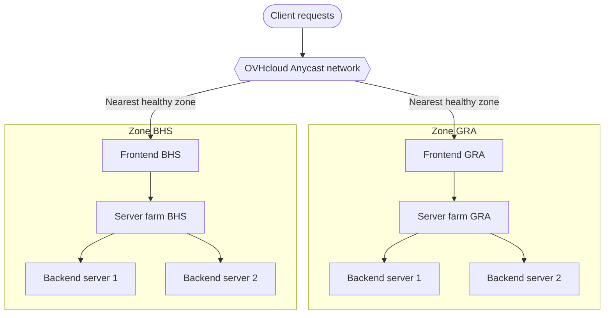

import Api from '@components/Api';
import ManagerLink from '@components/ManagerLink';

## Objective

This guide presents a reference design for deploying the OVHcloud Load Balancer across multiple availability zones to build a resilient, fault-tolerant service. It explains the topology, how traffic is distributed across zones, and how the service behaves when a zone becomes unavailable.

**In this guide, you will learn about:**

- The two multi-zone deployment models: multi-region and multi-Availability Zone (multi-AZ).
- A reference topology combining frontends, server farms, and backend servers per zone.
- How traffic is routed across zones using the Anycast network.
- The failover behaviour when a zone goes out of service.
- The configuration approach and the API endpoints that support it.

This is a conceptual reference design. For the step-by-step procedure to add and configure zones, refer to [Configure zones](/guides/network/load-balancer-revamp/configure-zones).

**This guide explains how to design a resilient multi-zone OVHcloud Load Balancer deployment.**

## Requirements

- An [OVHcloud Load Balancer](/links/network/load-balancer) service
- Access to the <ManagerLink to="/">OVHcloud Control Panel</ManagerLink>
- Backend servers deployed in two or more OVHcloud regions or Availability Zones
- A working knowledge of frontends and server farms. Refer to [Configure frontends](/guides/network/load-balancer-revamp/configure-frontends) and [Configure server farms](/guides/network/load-balancer-revamp/configure-server-farms).

## Introduction

The OVHcloud Load Balancer distributes incoming traffic across backend servers grouped into server farms, with frontends defining the entry points. When subscribing to the service, you select one or more availability zones to host it, and you can order additional zones for an existing service at any time.

Deploying the Load Balancer across several zones increases reliability if a zone becomes unavailable, and reduces latency by directing traffic to the entry point nearest to each user. For the underlying availability concepts, refer to [Availability and zones](/guides/network/load-balancer-revamp/availability-and-zones) and [High availability](/guides/network/load-balancer-revamp/high-availability).

## Multi-zone reference design

This section describes the two multi-zone deployment models, the reference topology, the traffic distribution mechanism, and the failover behaviour.

**Contents:**

- [Deployment models](#deployment-models)
- [Reference topology](#reference-topology)
- [Traffic distribution](#traffic-distribution)
- [Failover behaviour](#failover-behaviour)
- [Configuration approach](#configuration-approach)
- [Considerations and limitations](#considerations-and-limitations)

### Deployment models 

You can spread an OVHcloud Load Balancer service across multiple zones in two ways. The model you choose depends on whether your priority is recovery from a wide regional outage or high availability within a single region.

| Model | Scope | Primary benefit | Typical use |
|---|---|---|---|
| Multi-region | Zones located in different OVHcloud regions (for example `GRA` and `BHS`). Most regions have a single availability zone, so working with several zones usually means working with several regions. | Disaster recovery against a widespread regional outage, plus worldwide entry points that reduce latency by routing users to the nearest backend servers. | Geographically distributed users; recovery from the loss of an entire region. |
| Multi-AZ | Multiple Availability Zones within the same region (for example Paris 3-AZ or Milan 3-AZ). | High availability and fault tolerance against a local outage, using low-latency connections between zones. | Resilience within one region without cross-region latency. |

> [!INFO]
> OVHcloud is rolling out multi-Availability Zone (multi-AZ) regions, beginning with Paris 3-AZ and Milan 3-AZ. The list of available regions and their zones is published on the [OVHcloud global infrastructure page](https://www.ovhcloud.com/en-gb/about-us/global-infrastructure/regions/).

### Reference topology 

In a resilient multi-zone design, each zone hosts a frontend that points to a server farm in the same zone, and each farm contains backend servers located near that zone. This keeps traffic local to a zone under normal conditions and isolates the impact of a zone failure.

The diagram below shows a two-zone reference design spanning the Gravelines (`GRA`) and Beauharnois (`BHS`) regions.

{/* DRAFT: To screenshot - capture the Frontends tab in the Control Panel showing one frontend per zone */}

The table below maps each component of the reference topology to its role in the design.

| Component | Per zone | Role |
|---|---|---|
| Frontend | One | Entry point bound to a specific zone (or to the special `ALL` zone). |
| Server farm | One | Balances incoming traffic across the backend servers attached to it. |
| Backend servers | One or more | Host the application. Located near the zone they serve. |

> [!TIP]
> If you want the same configuration on every subscribed zone without duplicating it, bind a frontend to the special `ALL` zone. This deploys the identical configuration to all zones of the service. Use per-zone frontends instead when you need to control which backend servers serve which zone.

### Traffic distribution 

The OVHcloud Load Balancer relies on an Anycast network. A request entering from a given region is directed to the nearest zone, where the local frontend forwards it to the server farm in the same zone, and the farm balances it across the backend servers.

This design achieves two goals at once:

- **Lower latency:** users reach the closest entry point and the closest backend servers.
- **Locality:** under normal conditions, traffic stays within a single zone, which keeps cross-zone dependencies to a minimum.

For health-based routing within a farm, configure health probes so that traffic is not forwarded to unresponsive backend servers. Refer to [Configure health probes](/guides/network/load-balancer-revamp/configure-health-probes) and [Monitor server health](/guides/network/load-balancer-revamp/monitor-server-health).

### Failover behaviour 

When a zone becomes unavailable, the Anycast network stops directing traffic to that zone and routes new requests to the nearest remaining healthy zone. Because each zone is self-contained in the reference topology, the loss of one zone does not interrupt the others.

| Event | Behaviour |
|---|---|
| One zone is healthy, others fail | New requests are routed to the remaining healthy zone or zones via Anycast. |
| A zone recovers | Traffic is progressively routed back to the recovered zone as it becomes reachable again. |
| All backend servers in a zone fail (zone reachable) | Configure health probes so the farm stops forwarding traffic to unresponsive servers. Without probes, traffic may still be sent to failed servers. |

> [!warning]
> Due to technical restrictions, when a Load Balancer is configured with two zones where one is in an APAC region and the other is not, traffic is preferentially routed through the non-APAC zone first, even when the service is out of order in that zone. This behaviour is specific to cross-continent setups involving APAC zones, and OVHcloud does not recommend configuring the Load Balancer in this manner.

### Configuration approach 

Building the reference topology follows three stages. For the detailed procedure, refer to [Configure zones](/guides/network/load-balancer-revamp/configure-zones); the summary below shows where each stage maps in the Control Panel and the API.

1. **Order the additional zones.** Add the zones you need to your existing Load Balancer service.
2. **Create a server farm per zone.** Each farm holds the backend servers located near its zone.
3. **Create a frontend per zone.** Each frontend is bound to its zone and points to the farm in the same zone. Apply the configuration to deploy it.

#### In the Control Panel

Log in to the <ManagerLink to="/">OVHcloud Control Panel</ManagerLink> and open your Load Balancer service. Use the `Server Farms` tab to create one farm per zone with the `Create farm` button, then the `Frontends` tab to create one frontend per zone with the `Create frontend` button. In the frontend editor, set the zone (or `ALL`) and the `Default route` to the matching farm.

After any change, apply the configuration to deploy it to the zones.

{/* DRAFT: To screenshot - capture the frontend editor showing the zone field set to a specific zone */}

#### Via the OVHcloud API

The endpoints below create farms and frontends per zone and deploy the configuration. The `zone` field on a frontend determines which zone it is deployed in (use `all` for the special `ALL` zone).

Create a server farm for the HTTP service:

<Api version="v1" section="/ipLoadbalancing" method="POST" route={"/ipLoadbalancing/\{serviceName\}/http/farm"} />

| Parameter | Required | Description | Example |
|---|---|---|---|
| `serviceName` | Yes | Your Load Balancer service ID. | `loadbalancer-abcdef0123456789` |
| `zone` (body) | Yes | The zone in which the farm is created. | `gra` |

Add a backend server to the farm:

<Api version="v1" section="/ipLoadbalancing" method="POST" route={"/ipLoadbalancing/\{serviceName\}/http/farm/\{farmId\}/server"} />

| Parameter | Required | Description | Example |
|---|---|---|---|
| `serviceName` | Yes | Your Load Balancer service ID. | `loadbalancer-abcdef0123456789` |
| `farmId` | Yes | Your server farm ID. | `77212` |
| `address` (body) | Yes | The backend server's IPv4 address. | `10.10.1.100` |

Create a frontend bound to a zone:

<Api version="v1" section="/ipLoadbalancing" method="POST" route={"/ipLoadbalancing/\{serviceName\}/http/frontend"} />

| Parameter | Required | Description | Example |
|---|---|---|---|
| `serviceName` | Yes | Your Load Balancer service ID. | `loadbalancer-abcdef0123456789` |
| `defaultFarmId` (body) | No | The farm this frontend routes to by default. | `77212` |
| `port` (body) | Yes | The port exposed to clients. | `80` |
| `zone` (body) | Yes | The zone in which the frontend is deployed (`all` for every zone). | `gra` |

Apply the configuration to deploy all pending changes:

<Api version="v1" section="/ipLoadbalancing" method="POST" route={"/ipLoadbalancing/\{serviceName\}/refresh"} />

| Parameter | Required | Description |
|---|---|---|
| `serviceName` | Yes | Your Load Balancer service ID. |

You can also inspect the current state of the service and its zones:

<Api version="v1" section="/ipLoadbalancing" method="GET" route={"/ipLoadbalancing/\{serviceName\}/status"} />

<Api version="v1" section="/ipLoadbalancing" method="GET" route={"/ipLoadbalancing/\{serviceName\}/quota/\{zone\}"} />

> [!INFO]
> The `GET /ipLoadbalancing/availableZones` endpoint is deprecated. To discover the zones associated with a service and their quotas, use the `quota` endpoints above and the service properties on `GET /ipLoadbalancing/{serviceName}`.

For an automated, repeatable deployment of this topology, refer to [Automation](/guides/network/load-balancer-revamp/automation). [UNVERIFIED: terraform - confirm ovh_iploadbalancing* resources]

### Considerations and limitations 

Keep the following constraints in mind when designing a resilient multi-zone deployment.

| Consideration | Details |
|---|---|
| Cross-continent APAC routing | Mixing an APAC zone with a non-APAC zone causes traffic to prefer the non-APAC zone even when it is out of service. This configuration is not recommended. |
| Per-zone quotas | Each zone has its own quota. Verify quotas before scaling backend servers per zone. Refer to the `quota` endpoints above. |
| Health probes | Without health probes, the farm may forward traffic to unresponsive backend servers. Always configure probes in a resilient design. |
| Configuration deployment | Changes are not live until the configuration is applied. Apply after each change. |
| Service-level commitments | [TODO: confirm multi-zone SLA percentages] — refer to [SLAs](/guides/network/load-balancer-revamp/slas). |

## Go further

- [Configure zones](/guides/network/load-balancer-revamp/configure-zones)
- [Availability and zones](/guides/network/load-balancer-revamp/availability-and-zones)
- [High availability](/guides/network/load-balancer-revamp/high-availability)

Join our [community of users](/links/community).
