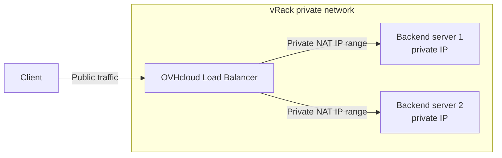

import Api from '@components/Api';
import { Tab, Tabs } from '@rspress/core/theme';
import ManagerLink from '@components/ManagerLink';

## Objective

The OVHcloud Load Balancer can reach your backend servers over a vRack private network instead of the public internet. This isolates backend traffic from the public network and removes the need to expose your servers on public IP addresses.

This guide walks you through the full workflow: attaching the Load Balancer to a vRack, declaring a private network (subnet and NAT range) so the Load Balancer knows your vRack topology, and creating server farms that reach backends over their private IP addresses.

**This guide explains how to configure the vRack on your OVHcloud Load Balancer to reach backend servers over private IP addresses.**

**In this guide, you will learn how to:**

- Attach a Load Balancer service to a vRack.
- Configure a private network (subnet, NAT IP range, and VLAN) on the Load Balancer.
- Create a server farm that reaches backends over their private IP addresses.

:::warning
Once a Load Balancer service is linked to a vRack, its server farms can no longer reach your servers over their public IP addresses. From that point on, the Load Balancer contacts your servers only through the private IP range you dedicate to it inside the vRack. Plan the cutover accordingly to avoid an interruption to backend connectivity.
:::

## Requirements

- An active OVHcloud account
- Access to the <ManagerLink to="/">OVHcloud Control Panel</ManagerLink>
- An OVHcloud Load Balancer (refer to [Order a Load Balancer](/guides/network/load-balancer-revamp/order-load-balancer))
- An existing [vRack](https://www.ovhcloud.com/en-gb/network/vrack/) with the network topology already defined
- The backend servers that will receive traffic already connected to the same vRack, each reachable on a private IP address
- OVHcloud API credentials for the API steps. Refer to the [First steps with the OVHcloud API](/guides/manage-and-operate/api/first-steps) guide.

## Introduction

The vRack is a private Layer 2 network that interconnects compatible OVHcloud services without traversing the public internet. When the Load Balancer is attached to a vRack, you assign it a dedicated range of private IP addresses (the NAT IP range) inside one of your vRack subnets. The Load Balancer uses that range as the source of all traffic sent to your backend servers, so the servers only see private source addresses and do not need public exposure.

You drive the vRack attachment, the private network definition, and the linking of farms to that network through the OVHcloud API. The `Subnet` tab in the <ManagerLink to="/">OVHcloud Control Panel</ManagerLink> lets you review and manage the private subnets once they exist.

## Instructions

**Contents:**

- [Overview](#overview)
- [Step 1 — Attach the Load Balancer to a vRack](#step-1)
- [Step 2 — Configure a private network](#step-2)
- [Step 3 — Create a farm linked to the private network](#step-3)
- [Verification](#verification)
- [Limitations](#limitations)
- [Troubleshooting](#troubleshooting)

### Overview 

Three pieces of configuration connect the Load Balancer to your private backends. First, attach the Load Balancer service to the vRack. Second, declare a private network on the Load Balancer: this tells it which subnet your servers live in, which VLAN to use, and which NAT IP range it may use as the source of backend traffic. Third, bind each server farm to that private network so its servers are addressed by their private IPs.

The diagram below shows the resulting traffic flow.

The key parameters of a private network are summarised below.

| Parameter | Description | Example |
|---|---|---|
| `subnet` | The CIDR range of the vRack subnet where your servers reside. | `192.168.0.0/16` |
| `natIp` | The CIDR range the Load Balancer uses as the source of backend traffic. Must be contained within `subnet` and dedicated to the Load Balancer. | `192.168.100.0/24` |
| `vlan` | The VLAN ID used for this network inside the vRack. | `42` |
| `vrackNetworkId` | The identifier returned when the private network is created. Required when binding a farm to the network. | `2001` |

:::info
The `natIp` range must be contained within the `subnet` range, and it must not overlap with addresses already assigned to your servers or other services in the vRack.
:::

### Step 1 — Attach the Load Balancer to a vRack 

This step links the Load Balancer service to your vRack through the OVHcloud API.

First, confirm that your Load Balancer service is eligible to join the vRack. The `serviceName` used by the vRack endpoints is the name of your vRack (for example, `pn-1234`), not the name of the Load Balancer.

<Api version="v1" section="/vrack" method="GET" route={"/vrack/\{serviceName\}/eligibleServices"} />

[UNVERIFIED: confirm GET /vrack/\{serviceName\}/eligibleServices — endpoint not present in the cached API map]

Eligible Load Balancer services are listed under the `ipLoadbalancing` index of the response. You can also read the eligibility of a specific Load Balancer service through the `vrackEligibility` attribute returned by the following call (here, `serviceName` is the Load Balancer service name):

<Api version="v1" section="/ipLoadbalancing" method="GET" route={"/ipLoadbalancing/\{serviceName\}"} />

Once eligibility is confirmed, attach the Load Balancer to the vRack:

<Api version="v1" section="/vrack" method="POST" route={"/vrack/\{serviceName\}/ipLoadbalancing"} />

[UNVERIFIED: confirm POST /vrack/\{serviceName\}/ipLoadbalancing — endpoint not present in the cached API map]

| Parameter | Required | Description | Example |
|---|---|---|---|
| `serviceName` (path) | Yes | The name of your vRack. | `pn-1234` |
| `ipLoadbalancing` (body) | Yes | The Load Balancer service to attach. | `loadbalancer-a1b2c3...` |

### Step 2 — Configure a private network 

For the Load Balancer to communicate with your backends, it must know the network topology inside your vRack and own a dedicated range of private IP addresses within it. This range is the only source of traffic the Load Balancer uses to contact your servers.

<Tabs>
<Tab label="Control Panel">

Go to the <ManagerLink to="/">OVHcloud Control Panel</ManagerLink> and open your Load Balancer service. Select the <code className="action">Subnet</code> tab, then create the private network for your vRack.

{/* DRAFT: To screenshot — capture the Subnet tab of the Load Balancer with the private network creation form open */}

:::info
The `Subnet` tab lists the private networks declared on your Load Balancer and lets you create or edit a subnet. The exact button labels for creating a subnet are not yet confirmed for the New Manager. [TODO: confirm the create-subnet button label on the `Subnet` tab]
:::

</Tab>
<Tab label="OVHcloud API">

Create the private network with the following call. The `serviceName` here is the Load Balancer service name.

<Api version="v1" section="/ipLoadbalancing" method="POST" route={"/ipLoadbalancing/\{serviceName\}/vrack/network"} />

[UNVERIFIED: confirm POST /ipLoadbalancing/\{serviceName\}/vrack/network — endpoint not present in the cached API map]

| Parameter | Required | Description | Example |
|---|---|---|---|
| `serviceName` (path) | Yes | The Load Balancer service name. | `loadbalancer-a1b2c3...` |
| `subnet` (body) | Yes | CIDR of the vRack subnet where your servers reside. | `192.168.0.0/16` |
| `natIp` (body) | Yes | CIDR range dedicated to the Load Balancer, contained within `subnet`. | `192.168.100.0/24` |
| `vlan` (body) | No | VLAN ID used for this network inside the vRack. | `42` |

To determine the minimum size required for the `natIp` range, use the following call before creating the network:

<Api version="v1" section="/ipLoadbalancing" method="GET" route={"/ipLoadbalancing/\{serviceName\}/vrack/networkCreationRules"} />

[UNVERIFIED: confirm GET /ipLoadbalancing/\{serviceName\}/vrack/networkCreationRules — endpoint not present in the cached API map]

You can review the NAT IP subnets already declared on the service with:

<Api version="v1" section="/ipLoadbalancing" method="GET" route={"/ipLoadbalancing/\{serviceName\}/natIp"} />

</Tab>
</Tabs>

:::warning
The `natIp` range must be contained within the `subnet` range. Choose a range that is dedicated to the Load Balancer and not used by any server or other service in the vRack.
:::

Once the private network is created, note its `vrackNetworkId`. You will need this identifier when you bind a server farm to the network in the next step.

### Step 3 — Create a farm linked to the private network 

Create your server farm and bind it to the private network by supplying the `vrackNetworkId` you obtained in the previous step. Apart from this field, you configure the farm exactly as you would a public farm.

<Tabs>
<Tab label="Control Panel">

Go to the <ManagerLink to="/">OVHcloud Control Panel</ManagerLink>, open your Load Balancer service, and select the <code className="action">Server Farms</code> tab. Click <code className="action">Create farm</code> and configure the farm as usual, selecting the private network you created so that backend servers are addressed by their private IP.

{/* DRAFT: To screenshot — capture the Create Server Farm form showing the private network / subnet selection */}

When you add servers to the farm, enter their private IP addresses inside the vRack. Click <code className="action">Add server</code> for each backend.

:::info
The field used to attach a farm to a private network in the New Manager is not yet confirmed. [TODO: confirm the private-network selection field label in the Create Server Farm form]
:::

</Tab>
<Tab label="OVHcloud API">

Create an HTTP farm and supply the `vrackNetworkId` field:

<Api version="v1" section="/ipLoadbalancing" method="POST" route={"/ipLoadbalancing/\{serviceName\}/http/farm"} />

For a TCP farm, use the equivalent endpoint:

<Api version="v1" section="/ipLoadbalancing" method="POST" route={"/ipLoadbalancing/\{serviceName\}/tcp/farm"} />

| Parameter | Required | Description | Example |
|---|---|---|---|
| `serviceName` (path) | Yes | The Load Balancer service name. | `loadbalancer-a1b2c3...` |
| `zone` (body) | Yes | The zone the farm is deployed in. | `gra` |
| `port` (body) | No | The port the farm forwards traffic to on the backends. | `80` |
| `vrackNetworkId` (body) | Yes (for vRack farms) | The identifier of the private network created in Step 2. | `2001` |

After creating the farm, add your backend servers using their private IP addresses. For the full farm and server configuration, refer to [Configure server farms](/guides/network/load-balancer-revamp/configure-server-farms).

</Tab>
<Tab label="Terraform">

[UNVERIFIED: terraform - confirm ovh_iploadbalancing* resources]

</Tab>
</Tabs>

Apply the configuration so the changes take effect:

<Api version="v1" section="/ipLoadbalancing" method="POST" route={"/ipLoadbalancing/\{serviceName\}/refresh"} />

:::tip
Configuration changes on the Load Balancer are staged until you apply them. Review pending changes with `GET /ipLoadbalancing/{serviceName}/pendingChanges` before applying.
:::

### Verification 

After applying the configuration, confirm that each part of the setup is in place.

| Check | How | Expected result |
|---|---|---|
| The Load Balancer is attached to the vRack | `GET /ipLoadbalancing/{serviceName}` and read the `vrackEligibility` / vRack attachment status | The service reports as attached to the vRack |
| The private network exists | List the declared NAT IP subnets with `GET /ipLoadbalancing/{serviceName}/natIp` | The `subnet`, `natIp`, and `vlan` you defined are returned |
| The farm is bound to the private network | `GET /ipLoadbalancing/{serviceName}/http/farm` (or `/tcp/farm`) and inspect the farm | The farm shows the expected `vrackNetworkId` |
| Backends are reachable over private IPs | List the farm servers and check their state | Servers report as reachable using their private IP addresses |

### Limitations 

| Limitation | Details |
|---|---|
| No public backend access after attachment | Once the Load Balancer is attached to a vRack, its farms can only reach servers over the private NAT IP range. Public backend IPs are no longer used. |
| NAT IP range containment | The `natIp` range must be contained within the declared `subnet` and must not overlap existing vRack addresses. |
| Minimum NAT IP size | The minimum size of the `natIp` range depends on the service. [TODO: confirm minimum natIp range size] |

### Troubleshooting 

This section lists the most common issues when configuring a vRack on the Load Balancer.

| Issue | Possible cause | Solution |
|---|---|---|
| Backends unreachable after attaching to vRack | Farms still reference public IP addresses | Update each farm server to use its private IP address inside the vRack, then apply the configuration. |
| Private network creation rejected | `natIp` not contained in `subnet`, or range too small | Use `GET /ipLoadbalancing/{serviceName}/vrack/networkCreationRules` to determine the minimum range, then choose a `natIp` contained within the `subnet`. |
| Configuration changes not active | Pending changes were not applied | Apply the configuration with `POST /ipLoadbalancing/{serviceName}/refresh`. |
| Farm cannot be bound to the private network | Missing or incorrect `vrackNetworkId` | Retrieve the correct `vrackNetworkId` from the created private network and supply it when creating or editing the farm. |

For broader diagnostics, refer to [Troubleshooting](/guides/network/load-balancer-revamp/troubleshooting).

## Go further

- [Configure server farms](/guides/network/load-balancer-revamp/configure-server-farms)
- [Route an additional IP to a backend](/guides/network/load-balancer-revamp/route-additional-ip)
- [Manage the Load Balancer via the Control Panel](/guides/network/load-balancer-revamp/manage-via-control-panel)

Join our [community of users](/links/community).
