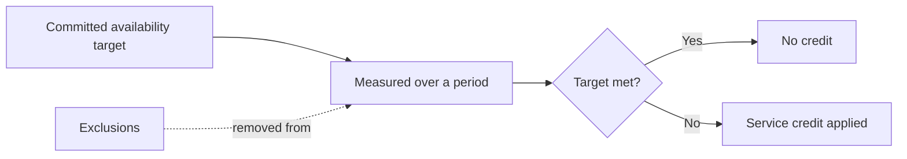

## Objective

This guide explains the service level commitments that apply to the OVHcloud Load Balancer. It describes what a service level agreement (SLA) is, which parts of the service the commitment covers, how availability is measured, and what falls outside the scope of the agreement.

It is intended for architects, operations teams, and decision-makers who need to understand the contractual availability guarantees before designing a production deployment on the Load Balancer.

**This guide explains the OVHcloud Load Balancer SLA: its scope, how availability is measured, and what the agreement excludes.**

> [!INFO]
> This is an informative guide. It explains concepts only and contains no configuration steps. For the binding terms, always refer to the official OVHcloud contractual documents, which take precedence over this guide.

## Overview

A service level agreement is a contractual commitment from OVHcloud that defines the expected availability of a service over a given period. It sets a measurable target, describes how that target is calculated, and specifies the compensation that applies if the target is not met.

For the Load Balancer, the SLA expresses the proportion of time during which the service is expected to be reachable and able to distribute traffic to your backend servers. The commitment applies to the OVHcloud-managed components of the service. It does not extend to elements you operate yourself, such as your backend servers, your application code, or your DNS configuration.

The SLA works alongside the architectural features of the Load Balancer. Availability zones and built-in redundancy reduce the impact of a single point of failure, while the SLA defines the contractual guarantee that backs those features. Understanding both helps you design a deployment that meets your availability objectives.

> [!TIP]
> An SLA is a guarantee about the OVHcloud service, not about your end-to-end application. The overall availability your users experience also depends on your backend servers, your network, and your application design.

## Key concepts

This section defines the terms used in service level commitments so that you can interpret the figures correctly.

### Availability

Availability is the percentage of time, over a defined measurement period, during which the service performs as committed. It is usually expressed as a percentage such as `99.9%`. The higher the percentage, the lower the maximum tolerated downtime.

The following table shows how common availability percentages translate into approximate downtime. The values are indicative and help you interpret an SLA figure; they are not the committed targets for the Load Balancer.

| Availability | Approximate downtime per month | Approximate downtime per year |
|---|---|---|
| 99% | ~7 hours 18 minutes | ~3 days 15 hours |
| 99.9% | ~43 minutes | ~8 hours 45 minutes |
| 99.95% | ~22 minutes | ~4 hours 22 minutes |
| 99.99% | ~4 minutes | ~52 minutes |

> [!INFO]
> The committed availability percentage for the OVHcloud Load Balancer is defined in the contractual documents. [TODO: verify SLA — confirm the committed availability percentage for the Load Balancer].

### Measurement period

The measurement period is the time window over which availability is calculated, typically a calendar month. Downtime is accumulated within this window and compared against the committed target at the end of the period. [TODO: verify SLA — confirm the measurement period used for the Load Balancer].

### Downtime

Downtime is any continuous interval during which the committed service is unavailable, as measured by OVHcloud. The way downtime is detected and recorded is defined in the contractual documents. Periods covered by an exclusion (see [Exclusions](#exclusions)) are not counted as downtime. [TODO: verify SLA — confirm how downtime is detected and from what threshold an interruption counts].

### Service credits

Service credits are the compensation granted when the committed availability is not met over a measurement period. They are usually expressed as a percentage of the recurring fee for the affected service and increase as the measured availability falls further below the target. The customer generally must request credits within a defined time frame after the incident. [TODO: verify SLA — confirm the service credit schedule and the procedure and deadline for requesting credits].

## SLA scope

The SLA applies only to the OVHcloud-managed components of the Load Balancer. The following table summarises what is covered and what remains your responsibility.

| Component | Covered by the Load Balancer SLA |
|---|---|
| Load Balancer service availability (frontends, traffic distribution) | Yes |
| OVHcloud-managed infrastructure hosting the Load Balancer | Yes |
| Your backend servers (health, capacity, application code) | No |
| Your DNS records pointing to the Load Balancer | No |
| Your network connectivity outside the OVHcloud network | No |
| Configuration you apply (farms, frontends, probes, certificates) | No |

OVHcloud provides the service, but you are responsible for its configuration and management. A correct configuration, including health probes and enough healthy backend servers, is required for the service to behave as expected.

> [!TIP]
> Configure health probes and distribute your backends across multiple [availability zones](/guides/network/load-balancer-revamp/availability-and-zones). The SLA covers the service, but your own resilience choices determine how much of the committed availability translates into uptime for your users.

## Exclusions

Certain events are excluded from the availability calculation and do not count as downtime. The exact list is defined in the contractual documents; the categories below are typical of infrastructure SLAs and are given for context.

- Scheduled maintenance announced in advance. [TODO: verify SLA — confirm the notice period and whether scheduled maintenance is excluded].
- Force majeure events outside the reasonable control of OVHcloud.
- Downtime caused by your own configuration, code, or backend servers.
- Suspension of the service for non-payment or for breach of the acceptable use policy.
- Interruptions caused by third-party networks or services outside the OVHcloud perimeter.

[TODO: verify SLA — confirm the complete and authoritative list of exclusions from the contractual documents].

## How availability relates to the architecture

The Load Balancer is designed with redundancy so that the service can continue to distribute traffic when a single component fails. The SLA is the contractual expression of that design.

To design for high availability, combine the SLA with the resilience features of the service: deploy across availability zones, configure health probes, and keep enough healthy backends to absorb the loss of one. For the architecture details, see the guides linked below.

## Considerations and limitations

Keep the following points in mind when interpreting the Load Balancer SLA.

- The SLA covers the OVHcloud service only. Your end-to-end availability also depends on components you operate.
- Availability figures, credit schedules, exclusions, and request procedures are defined in the contractual documents and may change. Always consult the current official terms.
- Service credits are typically not granted automatically; you usually need to request them within a defined deadline. [TODO: verify SLA — confirm whether credits are automatic or must be claimed].
- This guide does not reproduce the binding legal text. Where this guide and the contractual documents differ, the contractual documents prevail.

[TODO: verify SLA — link to the official OVHcloud Load Balancer SLA / service-specific conditions document].

## Go further

- [Availability and zones](/guides/network/load-balancer-revamp/availability-and-zones)
- [High availability](/guides/network/load-balancer-revamp/high-availability)
- [What is the OVHcloud Load Balancer](/guides/network/load-balancer-revamp/what-is-load-balancer)

Join our [community of users](/links/community).
