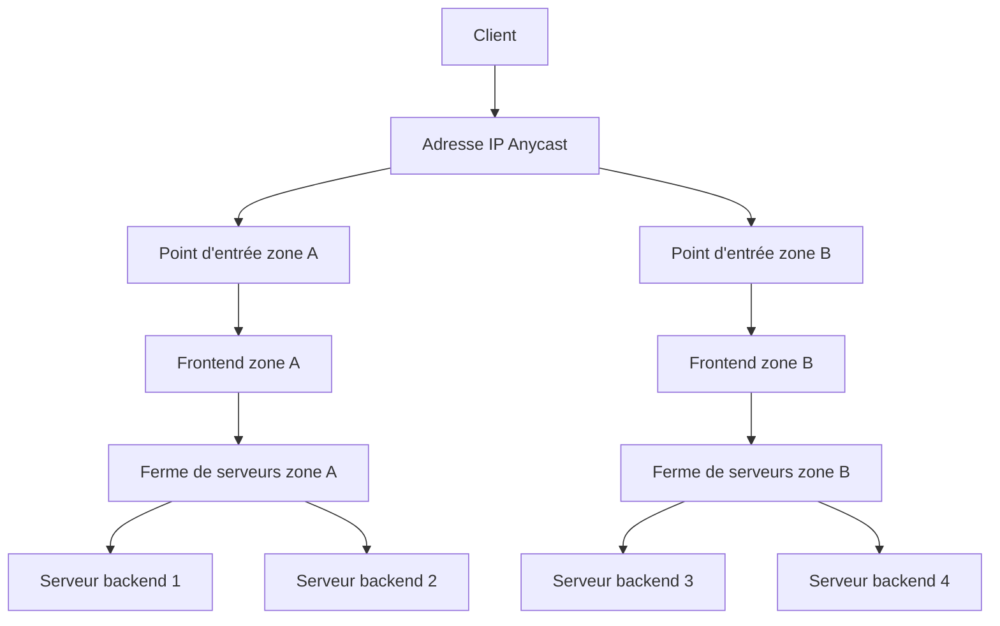
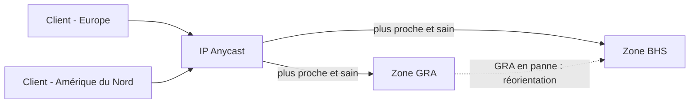
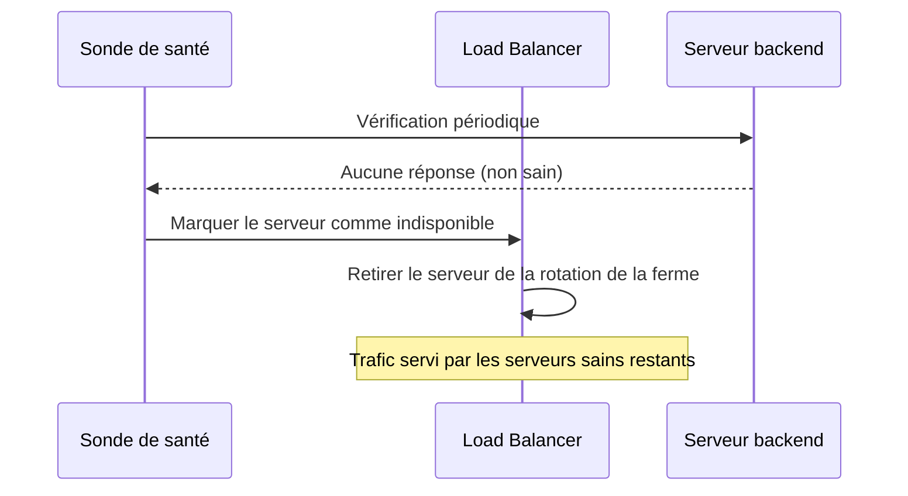
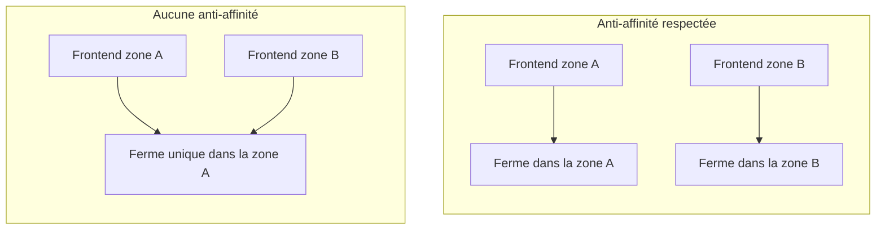

import Api from '@components/Api';

## Objectif

Ce guide explique comment le Load Balancer OVHcloud reste disponible lorsque des composants, des zones ou des régions individuels tombent en panne. Il s'adresse aux architectes et aux opérateurs qui ont besoin de comprendre le modèle de résilience avant de concevoir un déploiement en production.

**Après avoir lu ce guide, vous comprendrez les couches de redondance intégrées au service, la manière dont le trafic est dirigé avec Anycast, le comportement du failover et de l'anti-affinité, ainsi que les choix de conception qui augmentent la disponibilité de votre infrastructure.**

:::info
Ce guide est conceptuel. Pour mettre ces principes en pratique, consultez le guide [Architecture multizone résiliente](/guides/network/load-balancer-revamp/architecture-resilient-multi-zone) et le guide [Configurer les zones](/guides/network/load-balancer-revamp/configure-zones).
:::

## Vue d'ensemble

Le Load Balancer OVHcloud répartit le trafic entrant sur un ensemble de serveurs backend tout en masquant la défaillance d'un serveur, d'une zone ou d'une région donnés. La haute disponibilité est assurée à travers plusieurs couches qui fonctionnent conjointement :

- Au sein d'une même zone, le service lui-même s'exécute dans une configuration redondante afin que la perte d'un nœud n'interrompe pas le trafic.
- À travers plusieurs zones, le service peut être déployé de sorte qu'une zone entière puisse tomber en panne sans mettre le service hors ligne.
- À travers les régions, le routage Anycast dirige chaque client vers le point d'entrée sain le plus proche et redirige le trafic hors d'un emplacement défaillant.

La disponibilité dépend donc à la fois de la redondance qu'OVHcloud opère pour vous et de la topologie que vous choisissez lorsque vous commandez des zones et déclarez des frontends et des fermes de serveurs. La suite de ce guide décrit chaque couche ainsi que les décisions de conception qui affectent la résilience.

Le diagramme suivant montre le modèle de redondance en couches, depuis le point d'entrée Anycast jusqu'aux serveurs backend.

## Concepts clés

Cette section décrit les éléments constitutifs qui rendent le Load Balancer hautement disponible. Chaque concept traite d'un domaine de défaillance différent, depuis un seul serveur backend jusqu'à une région entière.

### Zones de disponibilité

Une zone de disponibilité est un emplacement isolé dans lequel un service Load Balancer peut s'exécuter. La plupart des régions OVHcloud exposent une seule zone ; travailler avec plusieurs zones revient donc généralement à travailler avec plusieurs régions. OVHcloud déploie également des régions multi-zones de disponibilité (multi-AZ), où plusieurs zones coexistent au sein d'une même région et sont reliées par des liens à faible latence.

Lorsque vous commandez un service Load Balancer, vous choisissez une ou plusieurs zones, et vous pouvez commander des zones supplémentaires pour un service existant ultérieurement. Le déploiement sur plus d'une zone est le mécanisme principal permettant de survivre à la perte d'une zone ou d'une région.

| Topologie | Domaine de défaillance couvert | Caractéristique de latence |
|---|---|---|
| Zone unique | Défaillance au niveau d'un nœud à l'intérieur de la zone | La plus faible, emplacement unique |
| Multi-AZ (une région) | Perte d'une zone au sein de la région | Faible, zones reliées par des connexions à faible latence |
| Multi-région | Perte d'une région entière | Plus élevée entre les régions, la plus faible vers la région la plus proche pour chaque client |

Pour une description détaillée des zones et des régions, consultez le guide [Disponibilité et zones](/guides/network/load-balancer-revamp/availability-and-zones).

### Redondance intra-zone

Au sein d'une même zone, le service Load Balancer ne s'exécute pas sur une seule machine. OVHcloud opère le plan de données de façon redondante afin que la défaillance d'un nœud sous-jacent soit absorbée sans interruption du service. Cette redondance est gérée par OVHcloud et ne nécessite aucune configuration de votre part.

La redondance intra-zone protège contre les défaillances au niveau des composants à l'intérieur d'une zone. Elle ne protège pas, à elle seule, contre la perte de la zone ou de la région entière ; cela nécessite une topologie multizone.

### Routage Anycast

Le Load Balancer est accessible via une adresse IP Anycast. La même adresse IP est annoncée depuis chaque zone dans laquelle votre service est déployé, et le réseau achemine chaque client vers le point d'entrée topologiquement le plus proche. Cela produit deux avantages :

- La latence est réduite car les clients atteignent la zone la plus proche.
- La disponibilité est accrue car, lorsqu'une zone cesse d'annoncer l'adresse, le réseau converge vers les zones restantes.

Le diagramme ci-dessous montre comment deux clients situés à des emplacements différents atteignent des zones différentes via la même adresse Anycast, et comment le trafic est réorienté lorsqu'une zone devient indisponible.

:::info
En raison de restrictions techniques, lorsqu'un Load Balancer est configuré avec deux zones dont l'une se trouve dans une région APAC et l'autre non, le trafic est acheminé en priorité par la zone non-APAC en premier, même lorsque le service est hors service dans cette zone. Ce comportement est spécifique aux configurations intercontinentales impliquant des zones APAC, et OVHcloud ne recommande pas de configurer un Load Balancer de cette manière.
:::

### Sondes de santé et failover

Le failover est le processus consistant à retirer une cible non saine de la rotation et à envoyer son trafic ailleurs. Le Load Balancer vérifie en continu l'état de santé de chaque serveur backend d'une ferme à l'aide de sondes de santé configurables. Lorsqu'un serveur échoue à sa sonde, le Load Balancer cesse de lui envoyer de nouvelles requêtes et répartit le trafic sur les serveurs sains restants de la ferme.

Le failover opère à deux niveaux :

- **Niveau backend.** Un serveur défaillant est retiré de sa ferme ; le frontend continue de servir le trafic à partir des serveurs survivants.
- **Niveau zone.** Lorsqu'une zone devient indisponible, la convergence Anycast dirige les clients vers les points d'entrée qui annoncent encore l'adresse dans les autres zones.

Les sondes de santé sont essentielles à ce comportement. Sans sondes, le Load Balancer ne peut pas détecter un backend qui ne répond pas et peut continuer à lui envoyer du trafic. Pour les configurer, consultez le guide [Configurer les sondes de santé](/guides/network/load-balancer-revamp/configure-health-probes).

### Anti-affinité entre zones

L'anti-affinité est le principe consistant à placer des composants redondants dans des domaines de défaillance distincts afin qu'une seule panne ne puisse pas en mettre plus d'un hors service. Pour le Load Balancer, cela signifie répartir vos frontends et vos fermes de serveurs sur plusieurs zones plutôt que de les concentrer dans une seule.

Pour bénéficier de la redondance au niveau des zones, déclarez un frontend dans chaque zone et rattachez-le à une ferme de serveurs dont les serveurs backend résident dans cette même zone. Cela permet à chaque zone de rester autonome : une requête qui arrive dans une zone est servie entièrement au sein de cette zone, de sorte que la perte d'une zone ne se propage pas aux autres.

Lorsque vous souhaitez appliquer la même configuration à chaque zone souscrite sans la dupliquer, vous pouvez rattacher un frontend à la zone spéciale `ALL`. Cela déploie une configuration identique sur toutes les zones du service.

Le diagramme ci-dessous oppose une configuration sans anti-affinité à une configuration où chaque zone est autonome.

## Considérations de conception

La disponibilité que vous obtenez dépend de la manière dont vous combinez les couches ci-dessus. Les considérations suivantes vous aident à faire correspondre la topologie à vos objectifs de résilience.

### Faire correspondre la topologie au domaine de défaillance auquel vous devez survivre

Décidez quelles défaillances le déploiement doit tolérer avant de choisir une topologie. Une zone unique absorbe les défaillances au niveau des nœuds gérées par OVHcloud. Une région multi-AZ ajoute une tolérance à la perte d'une zone au sein de cette région. Un déploiement multi-région ajoute une tolérance à la perte d'une région entière et réduit la latence pour un public géographiquement distribué.

| Objectif de résilience | Topologie recommandée |
|---|---|
| Survivre uniquement aux défaillances de nœuds | Zone unique |
| Survivre à la perte d'une zone, rester dans une seule région | Région multi-AZ |
| Survivre à la perte d'une région, servir un public mondial | Multi-région |

### Garder chaque zone autonome

Associez chaque frontend à une ferme de serveurs dans la même zone afin que le trafic entrant dans une zone y soit servi. Un frontend dans une zone qui dépend d'une ferme située uniquement dans une autre zone réintroduit un point de défaillance unique et va à l'encontre de l'objectif du déploiement multizone.

### Toujours configurer des sondes de santé

Le failover repose sur les sondes de santé pour détecter les backends qui ne répondent pas. Configurez une sonde sur chaque ferme afin que les serveurs défaillants soient retirés automatiquement de la rotation. Sans sondes, le trafic peut continuer d'atteindre des serveurs qui ne sont plus en mesure de répondre.

### Éviter les appariements intercontinentaux APAC

L'appariement d'une zone APAC avec une zone non-APAC produit un routage préférentiel qui ne bascule pas comme prévu. Si vous avez besoin d'une couverture en APAC et ailleurs, examinez le comportement de routage décrit dans le guide [Disponibilité et zones](/guides/network/load-balancer-revamp/availability-and-zones) avant de vous engager dans cette topologie.

### Appliquer les modifications de configuration de manière réfléchie

Les modifications apportées aux frontends et aux fermes ne prennent effet qu'une fois la configuration appliquée à chaque zone. Vérifiez qu'une modification a bien été appliquée à toutes les zones souscrites avant de vous fier au nouveau comportement, afin que la redondance ne reste pas partiellement configurée.

## Automatisation

La topologie de redondance peut être inspectée et gérée via l'API OVHcloud et le provider Terraform OVHcloud. Utilisez l'automatisation pour provisionner des zones, des frontends et des fermes de manière cohérente entre les environnements et pour appliquer les modifications de configuration de façon reproductible.

Pour examiner la topologie actuelle d'un service, récupérez ses frontends et fermes définis :

<Api version="v1" section="/ipLoadbalancing" method="GET" route={"/ipLoadbalancing/\{serviceName\}/definedFrontends"} />

<Api version="v1" section="/ipLoadbalancing" method="GET" route={"/ipLoadbalancing/\{serviceName\}/definedFarms"} />

| Paramètre | Requis | Description |
|---|---|---|
| `serviceName` | Oui | L'identifiant de votre service Load Balancer. |

Après avoir modifié des frontends ou des fermes, appliquez la configuration afin que la modification prenne effet sur l'ensemble des zones du service :

<Api version="v1" section="/ipLoadbalancing" method="POST" route={"/ipLoadbalancing/\{serviceName\}/refresh"} />

| Paramètre | Requis | Description |
|---|---|---|
| `serviceName` | Oui | L'identifiant de votre service Load Balancer. |

Pour les workflows d'infrastructure-as-code, le provider Terraform OVHcloud expose des ressources équivalentes pour les services, les frontends et les fermes.

[UNVERIFIED: terraform - confirm ovh_iploadbalancing* resources]

Pour une vue d'ensemble plus large des surfaces d'automatisation, consultez le guide [Automatisation](/guides/network/load-balancer-revamp/automation).

## Considérations et limitations

La disponibilité du Load Balancer dépend de facteurs en partie gérés par OVHcloud et en partie déterminés par votre configuration.

- La redondance intra-zone est gérée par OVHcloud et ne peut pas être configurée par le client.
- La redondance au niveau des zones et des régions nécessite que vous souscriviez à plus d'une zone et que vous déclariez les frontends et les fermes en conséquence.
- Le comportement du failover dépend de sondes de santé correctement configurées ; des sondes mal configurées peuvent soit ne pas détecter les pannes, soit retirer prématurément des serveurs sains.
- Les topologies intercontinentales impliquant des zones APAC ne basculent pas comme prévu et ne sont pas recommandées.
- L'engagement de disponibilité du service est défini par son contrat de niveau de service.

[TODO: confirm the published SLA percentage for the OVHcloud Load Balancer]

Pour les conditions contractuelles de disponibilité, consultez le guide [SLA](/guides/network/load-balancer-revamp/slas).

## Aller plus loin

- [Architecture multizone résiliente](/guides/network/load-balancer-revamp/architecture-resilient-multi-zone)
- [Disponibilité et zones](/guides/network/load-balancer-revamp/availability-and-zones)
- [Configurer les sondes de santé](/guides/network/load-balancer-revamp/configure-health-probes)

Échangez avec notre [communauté d'utilisateurs](https://community.ovh.com/).
