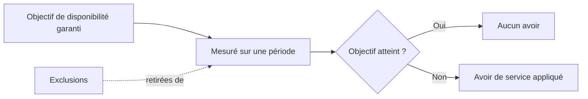

## Objectif

Ce guide explique les engagements de niveau de service qui s'appliquent à l'OVHcloud Load Balancer. Il décrit ce qu'est un accord de niveau de service (SLA), quelles parties du service l'engagement couvre, comment la disponibilité est mesurée et ce qui se situe en dehors du périmètre de l'accord.

Il s'adresse aux architectes, aux équipes d'exploitation et aux décideurs qui ont besoin de comprendre les garanties contractuelles de disponibilité avant de concevoir un déploiement en production sur le Load Balancer.

**Ce guide explique le SLA de l'OVHcloud Load Balancer : son périmètre, la manière dont la disponibilité est mesurée et ce que l'accord exclut.**

> [!INFO]
> Il s'agit d'un guide informatif. Il explique uniquement des concepts et ne contient aucune étape de configuration. Pour connaître les conditions contraignantes, reportez-vous toujours aux documents contractuels officiels d'OVHcloud, qui prévalent sur ce guide.

## Présentation générale

Un accord de niveau de service est un engagement contractuel d'OVHcloud qui définit la disponibilité attendue d'un service sur une période donnée. Il fixe un objectif mesurable, décrit la manière dont cet objectif est calculé et précise la compensation applicable si l'objectif n'est pas atteint.

Pour le Load Balancer, le SLA exprime la proportion de temps pendant laquelle le service est censé être accessible et capable de répartir le trafic vers vos serveurs de backend. L'engagement s'applique aux composants du service gérés par OVHcloud. Il ne s'étend pas aux éléments que vous exploitez vous-même, tels que vos serveurs de backend, le code de votre application ou votre configuration DNS.

Le SLA fonctionne de concert avec les caractéristiques architecturales du Load Balancer. Les zones de disponibilité et la redondance intégrée réduisent l'impact d'un point de défaillance unique, tandis que le SLA définit la garantie contractuelle qui soutient ces fonctionnalités. Comprendre les deux vous aide à concevoir un déploiement qui répond à vos objectifs de disponibilité.

> [!TIP]
> Un SLA est une garantie portant sur le service OVHcloud, et non sur votre application de bout en bout. La disponibilité globale perçue par vos utilisateurs dépend également de vos serveurs de backend, de votre réseau et de la conception de votre application.

## Concepts clés

Cette section définit les termes employés dans les engagements de niveau de service afin que vous puissiez interpréter correctement les chiffres.

### Disponibilité

La disponibilité est le pourcentage de temps, sur une période de mesure définie, pendant lequel le service fonctionne conformément à l'engagement. Elle est généralement exprimée sous forme de pourcentage, par exemple `99.9%`. Plus le pourcentage est élevé, plus la durée d'indisponibilité maximale tolérée est faible.

Le tableau suivant montre comment les pourcentages de disponibilité courants se traduisent en durée d'indisponibilité approximative. Ces valeurs sont indicatives et vous aident à interpréter un chiffre de SLA ; il ne s'agit pas des objectifs garantis pour le Load Balancer.

| Disponibilité | Indisponibilité approximative par mois | Indisponibilité approximative par an |
|---|---|---|
| 99% | ~7 heures 18 minutes | ~3 jours 15 heures |
| 99.9% | ~43 minutes | ~8 heures 45 minutes |
| 99.95% | ~22 minutes | ~4 heures 22 minutes |
| 99.99% | ~4 minutes | ~52 minutes |

> [!INFO]
> Le pourcentage de disponibilité garanti pour l'OVHcloud Load Balancer est défini dans les documents contractuels. [TODO: verify SLA — confirm the committed availability percentage for the Load Balancer].

### Période de mesure

La période de mesure est la fenêtre temporelle sur laquelle la disponibilité est calculée, généralement un mois calendaire. La durée d'indisponibilité est cumulée à l'intérieur de cette fenêtre et comparée à l'objectif garanti à la fin de la période. [TODO: verify SLA — confirm the measurement period used for the Load Balancer].

### Indisponibilité

L'indisponibilité correspond à tout intervalle continu pendant lequel le service garanti est inaccessible, tel que mesuré par OVHcloud. La manière dont l'indisponibilité est détectée et enregistrée est définie dans les documents contractuels. Les périodes couvertes par une exclusion (voir [Exclusions](#exclusions)) ne sont pas comptabilisées comme une indisponibilité. [TODO: verify SLA — confirm how downtime is detected and from what threshold an interruption counts].

### Avoirs de service

Les avoirs de service constituent la compensation accordée lorsque la disponibilité garantie n'est pas atteinte sur une période de mesure. Ils sont généralement exprimés sous forme de pourcentage des frais récurrents du service concerné et augmentent à mesure que la disponibilité mesurée s'éloigne de l'objectif. Le client doit en général demander les avoirs dans un délai défini après l'incident. [TODO: verify SLA — confirm the service credit schedule and the procedure and deadline for requesting credits].

## Périmètre du SLA

Le SLA s'applique uniquement aux composants du Load Balancer gérés par OVHcloud. Le tableau suivant résume ce qui est couvert et ce qui reste sous votre responsabilité.

| Composant | Couvert par le SLA du Load Balancer |
|---|---|
| Disponibilité du service Load Balancer (frontends, répartition du trafic) | Oui |
| Infrastructure gérée par OVHcloud hébergeant le Load Balancer | Oui |
| Vos serveurs de backend (état, capacité, code applicatif) | Non |
| Vos enregistrements DNS pointant vers le Load Balancer | Non |
| Votre connectivité réseau en dehors du réseau OVHcloud | Non |
| La configuration que vous appliquez (fermes, frontends, sondes, certificats) | Non |

OVHcloud fournit le service, mais vous êtes responsable de sa configuration et de sa gestion. Une configuration correcte, incluant des sondes de santé et un nombre suffisant de serveurs de backend sains, est nécessaire pour que le service se comporte comme prévu.

> [!TIP]
> Configurez des sondes de santé et répartissez vos backends sur plusieurs [zones de disponibilité](/guides/network/load-balancer-revamp/availability-and-zones). Le SLA couvre le service, mais ce sont vos propres choix de résilience qui déterminent dans quelle mesure la disponibilité garantie se traduit en temps de fonctionnement pour vos utilisateurs.

## Exclusions

Certains événements sont exclus du calcul de la disponibilité et ne sont pas comptabilisés comme une indisponibilité. La liste exacte est définie dans les documents contractuels ; les catégories ci-dessous sont caractéristiques des SLA d'infrastructure et sont fournies à titre indicatif.

- Les opérations de maintenance planifiées annoncées à l'avance. [TODO: verify SLA — confirm the notice period and whether scheduled maintenance is excluded].
- Les événements de force majeure échappant au contrôle raisonnable d'OVHcloud.
- L'indisponibilité causée par votre propre configuration, votre code ou vos serveurs de backend.
- La suspension du service pour défaut de paiement ou pour non-respect de la politique d'utilisation acceptable.
- Les interruptions causées par des réseaux ou services tiers situés en dehors du périmètre d'OVHcloud.

[TODO: verify SLA — confirm the complete and authoritative list of exclusions from the contractual documents].

## Lien entre la disponibilité et l'architecture

Le Load Balancer est conçu avec de la redondance afin que le service puisse continuer à répartir le trafic en cas de défaillance d'un composant unique. Le SLA est l'expression contractuelle de cette conception.

Pour concevoir une architecture à haute disponibilité, combinez le SLA avec les fonctionnalités de résilience du service : déployez sur plusieurs zones de disponibilité, configurez des sondes de santé et conservez suffisamment de backends sains pour absorber la perte de l'un d'entre eux. Pour les détails d'architecture, consultez les guides indiqués ci-dessous.

## Points à prendre en compte et limitations

Gardez à l'esprit les points suivants lors de l'interprétation du SLA du Load Balancer.

- Le SLA couvre uniquement le service OVHcloud. Votre disponibilité de bout en bout dépend également des composants que vous exploitez.
- Les chiffres de disponibilité, les barèmes d'avoirs, les exclusions et les procédures de demande sont définis dans les documents contractuels et peuvent évoluer. Consultez toujours les conditions officielles en vigueur.
- Les avoirs de service ne sont généralement pas accordés automatiquement ; vous devez en principe en faire la demande dans un délai défini. [TODO: verify SLA — confirm whether credits are automatic or must be claimed].
- Ce guide ne reproduit pas le texte juridique contraignant. En cas de divergence entre ce guide et les documents contractuels, ces derniers prévalent.

[TODO: verify SLA — link to the official OVHcloud Load Balancer SLA / service-specific conditions document].

## Aller plus loin

- [Disponibilité et zones](/guides/network/load-balancer-revamp/availability-and-zones)
- [Haute disponibilité](/guides/network/load-balancer-revamp/high-availability)
- [Qu'est-ce que l'OVHcloud Load Balancer](/guides/network/load-balancer-revamp/what-is-load-balancer)

Échangez avec notre [communauté d'utilisateurs](https://community.ovh.com/).
